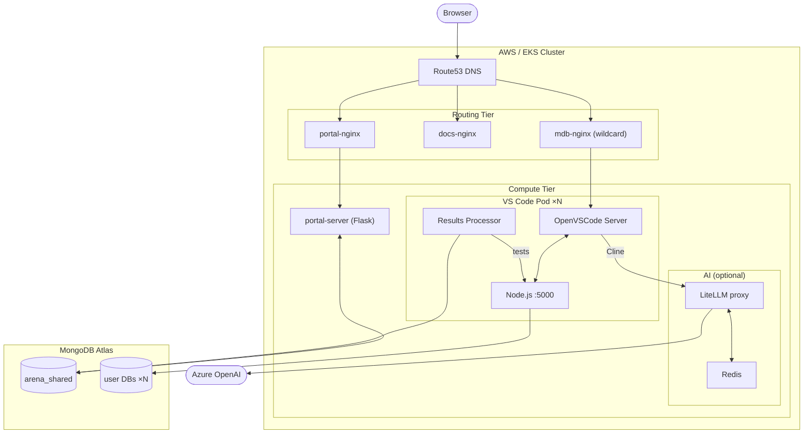
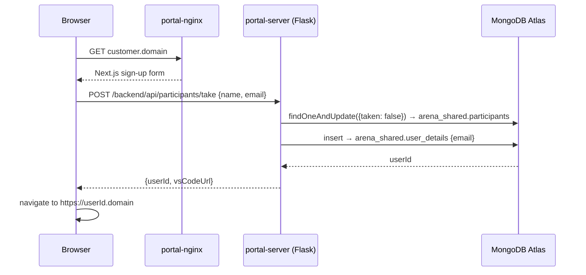
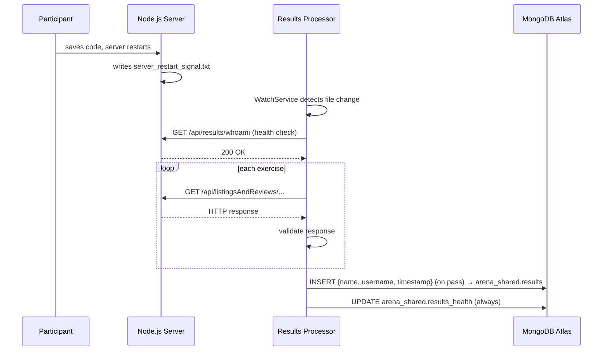

# MongoDB AI Arena

An interactive workshop platform where participants build a rental app powered by MongoDB, competing on a real-time leaderboard.

---

## For Workshop Participants

All instructions and exercises: **[mongoarena.com](https://mongoarena.com)**

> Your environment is pre-configured. Just follow the portal instructions.

---

## For MongoDB Solutions Architects

Setting up a workshop? **[Setup Guide](https://mongoarena.com/sa/)**

Need help? Join **[#ai-arena](https://mongodb.enterprise.slack.com/archives/C08JJKV3T0A)** on Slack.

---

## Architecture Overview

Each deployment is scoped to one customer/event and is fully managed by Terraform + Terragrunt from a single `config.yaml` file.

### Component Map

| Layer | Component | What it does |
|---|---|---|
| Data | **MongoDB Atlas** | Per-user databases + shared coordination DB (`arena_shared`) |
| Compute | **EKS (Auto Mode)** | One VS Code pod per participant, all other services |
| Storage | **AWS EFS** | Per-user 16 GiB persistent volume (workspace, config) |
| Routing | **mdb-nginx** | Wildcard proxy — routes `<userId>.<domain>` to each VS Code pod |
| Routing | **portal-nginx** | Serves the Next.js workshop portal at `<customer>.<domain>` |
| Routing | **docs-nginx** | Builds and serves the Jekyll instructions site |
| Backend | **portal-server** (Flask) | REST API for the portal — sign-up, leaderboard, admin controls |
| Sidecar | **Results Processor** (Java) | Watches for server restarts, auto-grades exercises, writes results to Atlas |
| Config bus | **scenario-definition** | Init pod: reads `config.yaml`, writes enhanced config to Atlas + K8s ConfigMap |
| AI assistant | **LiteLLM proxy** (optional) | OpenAI-compatible proxy → Azure OpenAI, with Redis caching |
| Cache | **Redis** (optional) | Caches LiteLLM completions (TTL 1800 s) to reduce API costs |
| Infra | **Terragrunt / Terraform** | Orchestrates all AWS and Atlas resources from `config.yaml` |



---

### MongoDB Atlas Cluster

One Atlas cluster per deployment (AWS `us-east-2` default, MongoDB 8.0, starts at M30 with compute auto-scaling M10–M80).

**Databases:**

- `sample_airbnb` — reference Airbnb dataset, populated at deploy time. Never written to by participants.
- `<userId>` (one per participant) — isolated copy of `sample_airbnb`. Each participant reads/writes only their own database.
- `arena_shared` — coordination database:
  - `participants` — slot roster (taken/available, name, leaderboard inclusion flag)
  - `user_details` — participant emails (kept separate from `participants` for privacy)
  - `results` — append-only exercise pass records: `{name, username, timestamp}`
  - `results_health` — per-user processor heartbeat and per-exercise pass/fail detail
  - `scenario_config` — single document with the full scenario config and navigation; written once by the scenario-definition pod at deploy time
  - `timed_leaderboard`, `score_leaderboard`, `user_leaderboard` — MongoDB views that aggregate results in real time

**Indexes:** Atlas Search index on `listingsAndReviews` (autocomplete on `name`, token filters on `amenities`/`property_type`) and an Atlas Vector Search index on `description` using `voyage-4` auto-embedding, backing the Search and Vector Search exercises.

**Credentials:** One admin user for internal services. One database user per participant with `readWrite` on their own database and a custom `arena-role` granting limited `arena_shared` access (read config and results, insert/update own results records, create indexes).

**Connectivity:** VPC-peered with the EKS VPC. Internal services (portal-server, scenario-definition) use the private SRV endpoint. VS Code pods use the public SRV endpoint, IP-whitelisted via the EKS security group.

---

### EKS Cluster

Single EKS cluster per deployment (EKS Auto Mode — nodes provision and deprovision automatically).

- **VPC** — dedicated `10.0.0.0/16`, two public subnets, VPC peered to Atlas
- **EFS** — one 16 GiB PVC per user; stores the participant workspace (git clone, node_modules, Cline config, built frontend)
- **TLS** — Let's Encrypt wildcard cert for `*.<customer>.mongoarena.com` via Route53 DNS-01 challenge, stored as a K8s Secret
- **DNS** — four Route53 records created at deploy time:

| Record | Target |
|---|---|
| `<customer>.mongoarena.com` | portal-nginx NLB |
| `instructions.<customer>.mongoarena.com` | docs-nginx NLB |
| `participants.<customer>.mongoarena.com` | docs-nginx NLB |
| `*.<customer>.mongoarena.com` | mdb-nginx NLB (wildcard — catches all per-user subdomains) |

---

### Per-User VS Code Pod

One Kubernetes Deployment per participant, accessible at `https://<userId>.<customer>.mongoarena.com`.

Built on `lscr.io/linuxserver/openvscode-server` with Node.js 24, Python 3.12, Java 21, mongosh, the MongoDB VS Code extension, and the Cline AI assistant extension pre-installed. The workshop repo and its `node_modules` are pre-baked into the image at `/opt/prebaked/` so first startup is fast (avoids writing thousands of files to EFS).

**Init container startup sequence:**
1. Reads `enhanced-scenario-config.json` from the mounted scenario ConfigMap.
2. Copies pre-baked workspace to EFS, or `git pull` if the workspace already exists.
3. Writes per-user `.env` to `server/` and `backend/` pointing `MONGODB_URI` at the participant's own Atlas database.
4. Configures the MongoDB VS Code extension with the Atlas connection string.
5. Pre-configures Cline with the LiteLLM endpoint and model, so participants skip the API-key screen.
6. Builds the Next.js frontend with the participant's `BACKEND_URL`.
7. (Guided mode only) Copies pre-filled answer files for exercises outside this deployment's scope.

---

### Results Processor (Java sidecar)

Runs inside each VS Code pod. Automatically grades the participant's code as they work — no manual submission needed.

**Trigger:** Uses Java `WatchService` to watch for `server_restart_signal.txt`. The participant's Node.js server writes this file on every startup. Falls back to hourly polling.

**What it tests:** HTTP calls to `localhost:5000` — CRUD, aggregation, Atlas Search, and Atlas Vector Search endpoints — validated against expected response shapes and query results. The active exercise list is read from `arena_shared.scenario_config`.

**On pass:** Inserts `{name, username, timestamp}` into `arena_shared.results`.  
**Always:** Updates `arena_shared.results_health` with per-exercise pass/fail status and failure reasons.

---

### nginx Tiers

**mdb-nginx** — a single nginx Deployment backing the Route53 wildcard record. Holds one `server {}` block per participant, proxying `<userId>.<domain>` to that user's pod. Config blocks are generated by Terraform and chunked into K8s ConfigMaps (100 users per ConfigMap to stay under the 1 MiB limit).

**portal-nginx** — serves the Next.js portal frontend and proxies `/backend/*` to portal-server.

**docs-nginx** — init container clones the repo, runs `jekyll build`, and nginx serves the static output. Navigation sections shown are filtered by `instructions.sections` in `config.yaml` (so you can scope a short workshop to just CRUD + Search).

---

### portal-server (Flask)

REST API for the portal. Connects to Atlas via the **private** SRV endpoint (VPC peering path) using admin credentials.

Key endpoints:

| Endpoint | Purpose |
|---|---|
| `POST /api/participants/take` | Atomically assigns a free slot (`findOneAndUpdate({taken:false})`); returns the `userId` that becomes the VS Code URL |
| `GET /api/results` | Leaderboard from `timed_leaderboard` or `score_leaderboard` view |
| `GET /api/users/progress` | Per-user status (stuck if >10 min since last exercise pass) |
| `POST /api/admin/database/restore` | Resets a user's Atlas database to `sample_airbnb` state using `$out` aggregation |
| `POST /api/admin/leaderboard/exclude` | Removes a user from the leaderboard |

---

### scenario-definition Pod

A Python init container that runs once at deploy time and acts as the configuration bus for the whole system.

1. Reads the Terraform-generated ConfigMap (serialised `config.yaml` + Atlas connection details).
2. Loads the navigation YAML from the workshop repo and filters it to the sections in `instructions.sections`.
3. Determines which exercises are in scope and which answer files should be pre-filled.
4. Writes the full enhanced config document to `arena_shared.scenario_config`.
5. Creates/updates the `scenario-definition-enhanced-config` Kubernetes ConfigMap, which is mounted into every VS Code pod.

This pod completes before any VS Code pods start, so every pod reads a consistent config on first boot.

---

### LiteLLM + Redis (optional)

**LiteLLM** — an OpenAI-compatible proxy deployed when `scenario.llm.proxy.enabled: true`. Routes Cline's requests to Azure OpenAI (`gpt-5-mini` or `gpt-5-chat`) without exposing API keys to participants. API key sourced from AWS Secrets Manager at deploy time.

**Redis** — caches LiteLLM completions and embeddings (TTL 1800 s, namespace `litellm.cline.cache`). Reduces Azure OpenAI costs when multiple participants ask similar questions.

---

## Data Flows

### Deployment

```
SA edits config.yaml
  └─▶ terragrunt apply atlas-cluster
        Atlas: cluster + per-user DB users created
        Python: populates sample_airbnb, creates Search/Vector Search indexes

  └─▶ terragrunt apply eks-cluster
        AWS:  VPC + EFS + Let's Encrypt TLS + Route53 DNS
        K8s:  scenario-definition pod
                ├─▶ writes enhanced config → arena_shared.scenario_config (Atlas)
                └─▶ writes scenario-definition-enhanced-config ConfigMap (K8s)
        K8s:  N VS Code pods (one per user)
                reads ConfigMap → seeds workspace → writes .env → builds frontend
        K8s:  mdb-nginx, portal-nginx, portal-server, docs-nginx, LiteLLM, Redis
```

### Participant Sign-Up



### Workshop Coding

```
Browser ──▶ https://<userId>.<domain>
            Route53 wildcard → mdb-nginx → VS Code pod (OpenVSCode Server)
              Participant edits server/src/lab/*.lab.js
              Cline ──▶ http://litellm-service:4000
                        LiteLLM → Redis (cache hit?)
                                  └─ miss → Azure OpenAI → Redis (store, TTL 1800s)
              Node.js server ──▶ MongoDB Atlas: <userId> database
```

### Automatic Exercise Testing



### Leaderboard Update

```
arena_shared.results (new insert)
  └─▶ timed_leaderboard view  (real-time: count, first→last timestamp delta)
        portal-server GET /api/results
        → Next.js Leaderboard component → all participant browsers (polling)
```

---

## Deployment & Scaling

All infrastructure is managed from `utils/arena-terragrunt/<customer>/config.yaml`. Two Terragrunt modules run in dependency order:

1. **`atlas-cluster/`** — Atlas cluster, users, data population (~15–20 min)
2. **`eks-cluster/`** — all AWS and K8s resources, consumes Atlas outputs (~30–40 min)

Run both with `terragrunt apply --all` from the customer directory. Remote state is stored in S3 (`s3://mongodb-arena/terragrunt/<customer>/`).

| Component | Scaling mechanism |
|---|---|
| MongoDB Atlas | Compute auto-scales M10–M80; disk auto-grows |
| EKS nodes | EKS Auto Mode — automatic provisioning and deprovisioning |
| VS Code pods | One Deployment per user; adding users to `user_list.csv` and re-applying adds pods |
| mdb-nginx | HPA |
| portal-nginx | HPA |
| docs-nginx | HPA |
| LiteLLM | HPA |
| Aurora PostgreSQL (optional) | Aurora Serverless v2, 0.5–1.0 ACU |
| EFS | Throughput scales with usage |
| Redis | Single pod with PVC |
