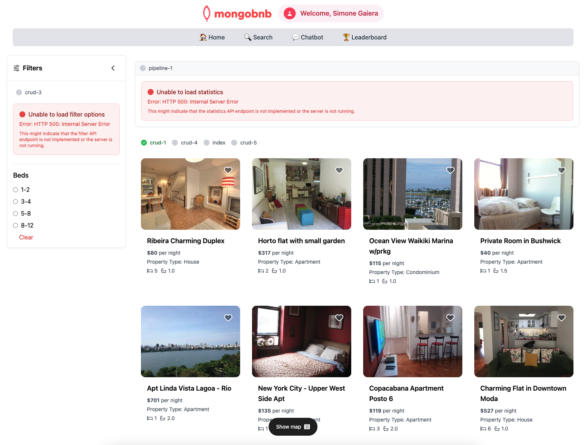

📋 Referencia del Lab

<strong>Archivo de Lab Asociado:</strong> <code>crud-1.lab.js</code>

## 🚀 Objetivo: Buscar, Ordenar y Paginar como un Profesional

El viaje de tu empresa en el mercado de alquileres a corto plazo acaba de comenzar, y el primer desafío es claro: necesitas ayudar a tus usuarios a descubrir el lugar perfecto para quedarse. Como ingeniero backend, es tu trabajo hacer que la búsqueda de listados sea rápida, precisa y deliciosa.

En este ejercicio, dominarás los conceptos básicos de MongoDB: buscar documentos, ordenar resultados y agregar paginación fluida a tus consultas. Esta es la base de toda gran plataforma de alquiler—asegurándote de que los huéspedes puedan navegar y explorar fácilmente lo que tu empresa tiene para ofrecer.

---

### 🧩 Ejercicio: Buscar Documentos

1. **Abre el Archivo**  
   Ve a `server/src/lab/` y abre `crud-1.lab.js`.

2. **Localiza la Función**  
   Encuentra la función `crudFind` en el archivo.

3. **Define la Consulta**  
   - Encuentra todos los documentos que coincidan con el parámetro `query` proporcionado.
   - Ordena los resultados por `_id` en orden ascendente.
   - Agrega paginación con:
     - `skip`: número de documentos a omitir
     - `limit`: máximo de documentos a devolver

---

### 🚦 Prueba tu API

1. Ve a `server/src/lab/rest-lab`.
2. Abre `crud-1-query-lab.http`.
3. Haz clic en **Send Request** para ejecutar la llamada a la API.

4. Verifica que la respuesta devuelva los resultados paginados.

---

### 🖥️ Validación Frontend

Una vez que tu lógica backend esté implementada, actualiza la página de inicio y observa cómo aparecen tus listados—listos para que tus futuros huéspedes los exploren. Desplázate por los resultados y observa la paginación en acción: suave, rápida y tal como a los usuarios les encanta.

**Verifica el Estado del Ejercicio:**  
Ve a la aplicación y comprueba si el indicador del ejercicio muestra verde, lo que indica que tu implementación es correcta.

Con este primer paso, no solo estás escribiendo código—estás construyendo la experiencia de búsqueda que ayudará a tu empresa a destacarse en el mercado de alquileres.  
**¿Listo para ayudar a tus usuarios a encontrar su próxima estadía? ¡Comencemos!**


