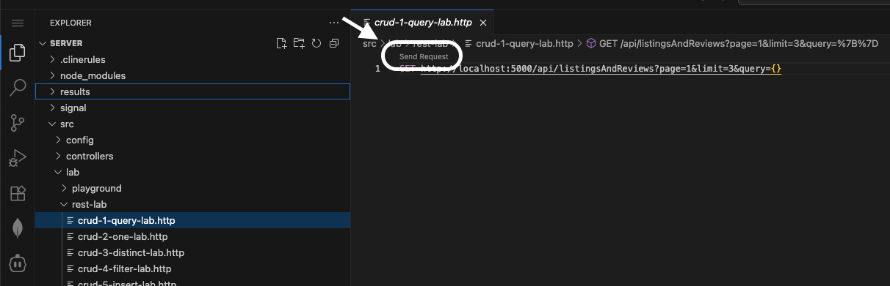
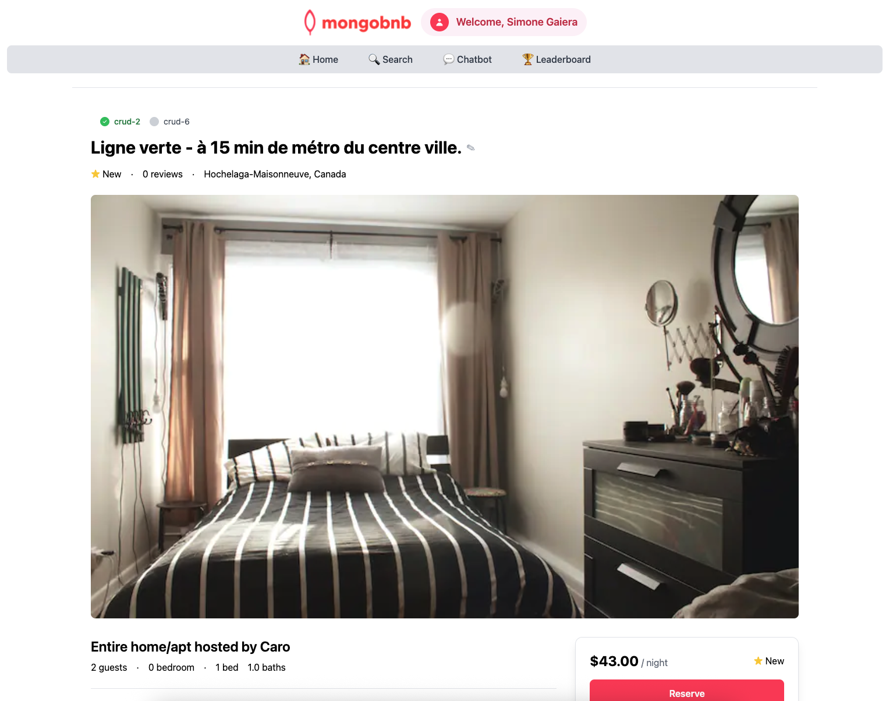

📋 Referencia del Lab

<strong>Archivo de Lab Asociado:</strong> <code>crud-2.lab.js</code>

## 🚀 Objetivo: Recuperar un Único Documento al Instante

Tu plataforma está creciendo, y ahora tus usuarios quieren más que solo una lista—¡quieren detalles! Imagina a un huésped haciendo clic en una propiedad para ver cada foto, comodidad y reseña. Como ingeniero backend, es tu trabajo entregar esa información instantánea y precisa.

En este ejercicio, desbloquearás el poder de `findOne` de MongoDB para obtener exactamente lo que tus usuarios necesitan, justo cuando lo necesitan.

---

### 🧩 Ejercicio: Buscar Un Documento

1. **Abre el Archivo**  
   Navega a `server/src/lab/` y abre `crud-2.lab.js`.

2. **Localiza la Función**  
   Encuentra la función `crudOneDocument` en el archivo.

3. **Define la Consulta**  
   - Implementa la función para encontrar un documento donde `_id` sea igual al parámetro `id` proporcionado.
   - Devuelve el documento completo que coincida con este criterio.

---

### 🚦 Prueba tu API

1. Ve a `server/src/lab/rest-lab`.
2. Abre `crud-2-one-lab.http`.
3. Haz clic en **Send Request** para ejecutar la llamada a la API.

4. Verifica que la respuesta devuelva el único documento que solicitaste.

---

### 🖥️ Validación Frontend

> **Importante:**  
> Para verificar si tu implementación funciona, **ve a la página de inicio de la aplicación y selecciona un listado**.  
> Esto abrirá la página de detalles de esa propiedad y activará tu nuevo código de API.

- Cuando selecciones un listado, deben aparecer todos los detalles de esa propiedad—rápidos, enfocados e impecables.
- **Verifica el Estado del Ejercicio:**  
  Busca el indicador del ejercicio en la página de detalles. ¡Si muestra verde, tu implementación es correcta!

Con este paso, no solo estás recuperando datos—estás dando vida a cada listado para tus usuarios.  
**¿Listo para entregar los detalles que hacen brillar tu plataforma? ¡Comencemos!**


