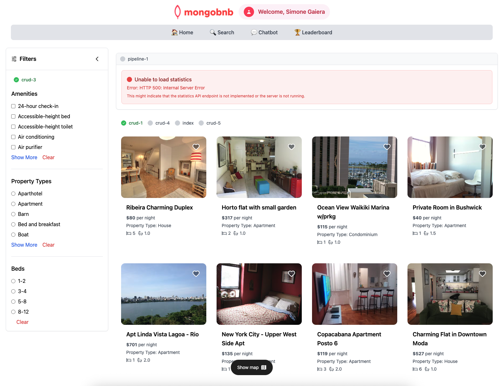

📋 Referencia del Lab

<strong>Archivo de Lab Asociado:</strong> <code>crud-3.lab.js</code>

## 🚀 Objetivo: Descubrir Valores Únicos como un Profesional

Tu plataforma está evolucionando, y ahora es el momento de dar a tus usuarios el poder de filtrar y explorar listados de nuevas maneras. Imagina a un huésped buscando propiedades por vecindario, comodidades o tipo de propiedad—los filtros dinámicos hacen que todo sea posible. Como ingeniero backend, usarás `distinct` de MongoDB para desbloquear estas funciones.

En este ejercicio, revelarás todos los valores únicos en cualquier campo, potenciando los filtros que ayudan a los huéspedes a encontrar exactamente lo que buscan.

---

### 🧩 Ejercicio: Encontrar Valores Únicos

1. **Abre el Archivo**  
   Navega a `server/src/lab/` y abre `crud-3.lab.js`.

2. **Localiza la Función**  
   Encuentra la función `crudDistinct` en el archivo.

3. **Define la Consulta**  
   - Usa el método `distinct` para recuperar todos los valores únicos del campo especificado por el parámetro `field_name`.
   - Devuelve un arreglo de todos los valores distintos encontrados en ese campo en toda la colección.

---

### 🚦 Prueba tu API

1. Ve a `server/src/lab/rest-lab`.
2. Abre `crud-3-distinct-lab.http`.
3. Haz clic en **Send Request** para ejecutar la llamada a la API.
4. Verifica que la respuesta devuelva una lista de valores únicos para el campo solicitado.

---

### 🖥️ Validación Frontend

Abre el panel de "Filtros" en la aplicación y observa cómo aparecen todos los valores distintos para el campo elegido—habilitando filtros dinámicos y amigables para tus huéspedes.

**Verifica el Estado del Ejercicio:**  
Ve a la aplicación y comprueba si el indicador del ejercicio muestra verde, lo que indica que tu implementación es correcta.

Con este paso, no solo estás obteniendo datos—estás empoderando a tus usuarios para descubrir la estancia perfecta, a su manera.  
**¿Listo para hacer tu plataforma más inteligente e interactiva? ¡Comencemos!**


