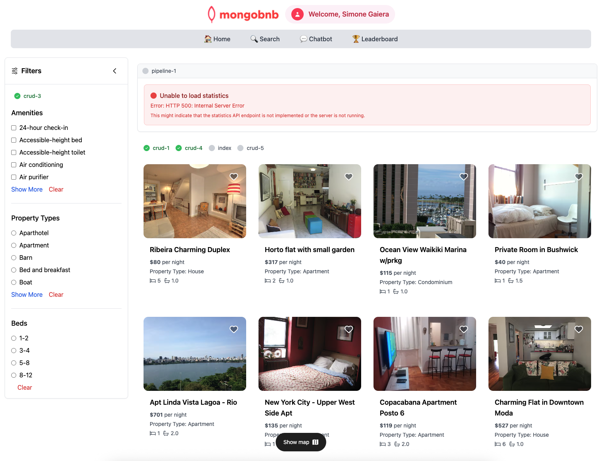

📋 Referencia del Lab

<strong>Archivo de Lab Asociado:</strong> <code>crud-4.lab.js</code>

## 🚀 Objetivo: Filtrado Avanzado y Paginación como un Profesional

Tu plataforma ahora está repleta de listados, y tus usuarios quieren encontrar su estancia perfecta—rápido. Imagina a un huésped buscando un acogedor apartamento con jacuzzi, o a una familia buscando una casa con el número exacto de camas. Como ingeniero backend, es tu trabajo hacer estas búsquedas fluidas y poderosas.

En este ejercicio, combinarás múltiples filtros y paginación para crear una experiencia de búsqueda dinámica y amigable para el usuario.

---

### 🧩 Ejercicio: Buscar Documentos con Filtros

1. **Abre el Archivo**  
   Navega a `server/src/lab/` y abre `crud-4.lab.js`.

2. **Localiza la Función**  
   Encuentra la función `crudFilter` en el archivo.

3. **Define la Consulta**  
   - Filtra por:
     - `amenities`: arreglo de comodidades seleccionadas
     - `propertyType`: tipo de propiedad específico
     - `beds`: rango de camas (formato: "2-3", "4-7")
   - Agrega paginación con:
     - `skip`: número de documentos a omitir
     - `limit`: máximo de documentos a devolver
   - ¿Sin filtros? Devuelve todos los documentos (con paginación).

---

### 🚦 Prueba tu API

1. Ve a `server/src/lab/rest-lab`.
2. Abre `crud-4-filter-lab.http`.
3. Haz clic en **Send Request** para ejecutar la llamada a la API.
4. Confirma que la respuesta devuelve documentos que coinciden con tus filtros.

---

### 🖥️ Validación Frontend

Establece diferentes filtros en el panel de "Filtros" de la aplicación y observa cómo tus listados se actualizan en tiempo real—¡rápido, flexible y fácil de usar!

**Verifica el Estado del Ejercicio:**  
Ve a la aplicación y comprueba si el indicador del ejercicio muestra verde, lo que indica que tu implementación es correcta.

Con este paso, no solo estás filtrando datos—estás ayudando a cada huésped a encontrar su estancia perfecta, sin importar lo que busquen.  
**¿Listo para hacer tu plataforma verdaderamente dinámica? ¡Comencemos!**


