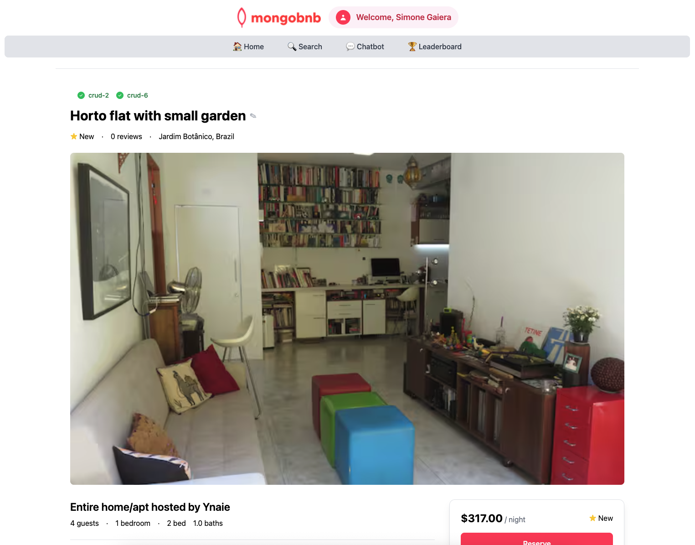

📋 Referencia del Lab

<strong>Archivo de Lab Asociado:</strong> <code>crud-6.lab.js</code>

## 🚀 Objetivo: Actualizar Cualquier Campo con $set—como un Profesional

Tu plataforma está prosperando, y tus usuarios esperan flexibilidad—ya sea actualizar el título de una propiedad, agregar una nueva comodidad o corregir un error tipográfico. Como ingeniero backend, eres el que hace posibles estas actualizaciones en tiempo real, manteniendo tus datos frescos y a tus usuarios felices.

En este ejercicio, aprovecharás el poder del operador `$set` de MongoDB para actualizar cualquier campo en tus documentos.

---

### 🧩 Ejercicio: Actualizar un Documento

1. **Abre el Archivo**  
   Navega a `server/src/lab/` y abre `crud-6.lab.js`.

2. **Localiza la Función**  
   Encuentra la función `crudUpdateElement` en el archivo.

3. **Define la Actualización**  
   - La función recibe tres parámetros:
     - `id`: El `_id` del documento
     - `key`: El nombre del campo a actualizar
     - `value`: El nuevo valor a establecer
   - Usa `$set` para actualizar el campo especificado con el nuevo valor—¡dinámico, flexible y poderoso!

---

### 🚦 Prueba tu API

1. Ve al directorio `server/src/lab/rest-lab`.
2. Abre `crud-6-update-lab.http`.
3. Haz clic en **Send Request** para ejecutar la llamada a la API.
4. Verifica que la respuesta muestre el documento con el campo actualizado.

---

### 🖥️ Validación Frontend

Edita un campo (como el Título) de un listado en la aplicación y observa cómo tus cambios persisten—incluso después de una actualización.

**Verifica el Estado del Ejercicio:**  
Ve a la aplicación y comprueba si el indicador del ejercicio muestra verde, lo que indica que tu implementación es correcta.

Con este paso, no solo estás actualizando datos—estás manteniendo tu plataforma fresca, relevante y receptiva a las necesidades de cada usuario.  
**¿Listo para dar un cambio de imagen a tus datos? ¡Comencemos!**


