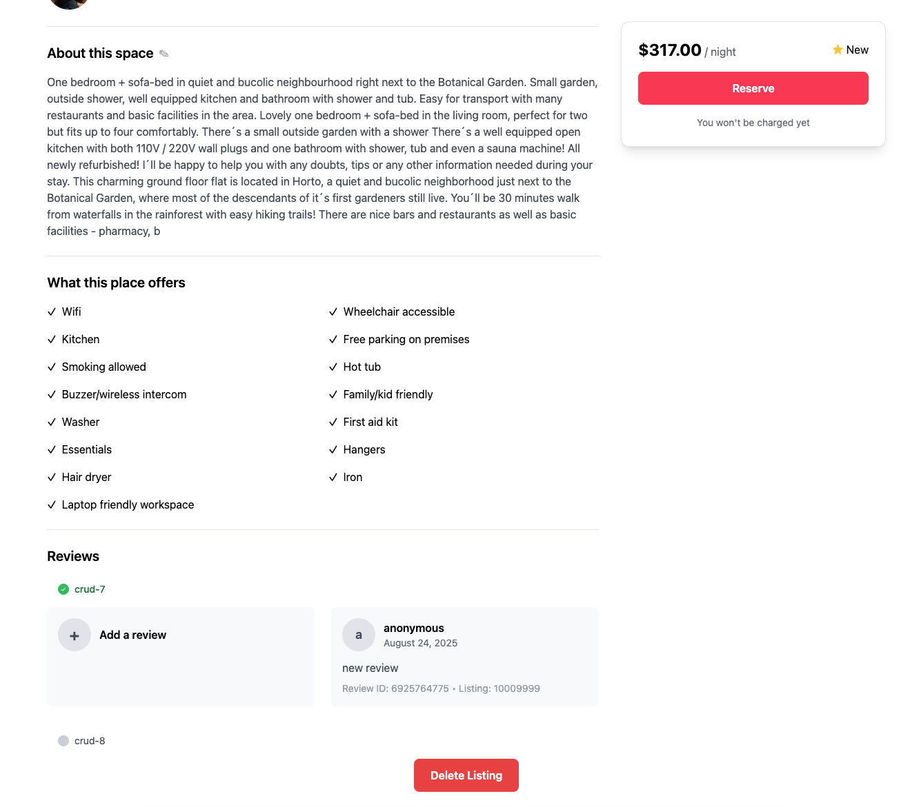

📋 Referencia del Lab

<strong>Archivo de Lab Asociado:</strong> <code>crud-7.lab.js</code>

## 🚀 Objetivo: Agregar a Arreglos sin Esfuerzo con $push

Tu plataforma está prosperando, y los huéspedes están ansiosos por compartir sus experiencias. Imagina a un viajero dejando una reseña brillante después de una estadía perfecta, o a un anfitrión recibiendo comentarios valiosos. Como ingeniero backend, haces posibles estos momentos—actualizando instantáneamente los listados con nuevas reseñas.

En este ejercicio, usarás el operador `$push` de MongoDB para agregar reseñas (o cualquier elemento de arreglo) a tus documentos.

---

### 🧩 Ejercicio: Agregar una Reseña a un Arreglo

1. **Abre el Archivo**  
   Navega a `server/src/lab/` y abre `crud-7.lab.js`.

2. **Localiza la Función**  
   Encuentra la función `crudAddToArray` en el archivo.

3. **Actualiza el Código**  
   - Usa `$push` para agregar la nueva reseña al arreglo `reviews`.
   - La función recibe dos parámetros:
     - `id`: El `_id` del documento
     - `review`: El objeto de reseña a agregar
   - Usa `$inc` para incrementar el campo `number_of_reviews` en 1.

---

### 🚦 Prueba tu API

1. Ve al directorio `server/src/lab/rest-lab`.
2. Abre `crud-7-reviews-lab.http`.
3. Haz clic en **Send Request** para ejecutar la llamada a la API.
4. Verifica que la respuesta muestre el documento actualizado con la nueva reseña.

---

### 🖥️ Validación Frontend

Agrega una nueva reseña en la aplicación y observa cómo aparece instantáneamente para el listado seleccionado—¡suave, dinámico y satisfactorio!

**Verifica el Estado del Ejercicio:**  
Ve a la aplicación y comprueba si el indicador del ejercicio muestra verde, lo que indica que tu implementación es correcta.

Con este paso, no solo estás actualizando arreglos—estás capturando las historias y comentarios que dan vida a tu plataforma.  
**¿Listo para que se escuchen las voces de tus usuarios? ¡Comencemos!**


