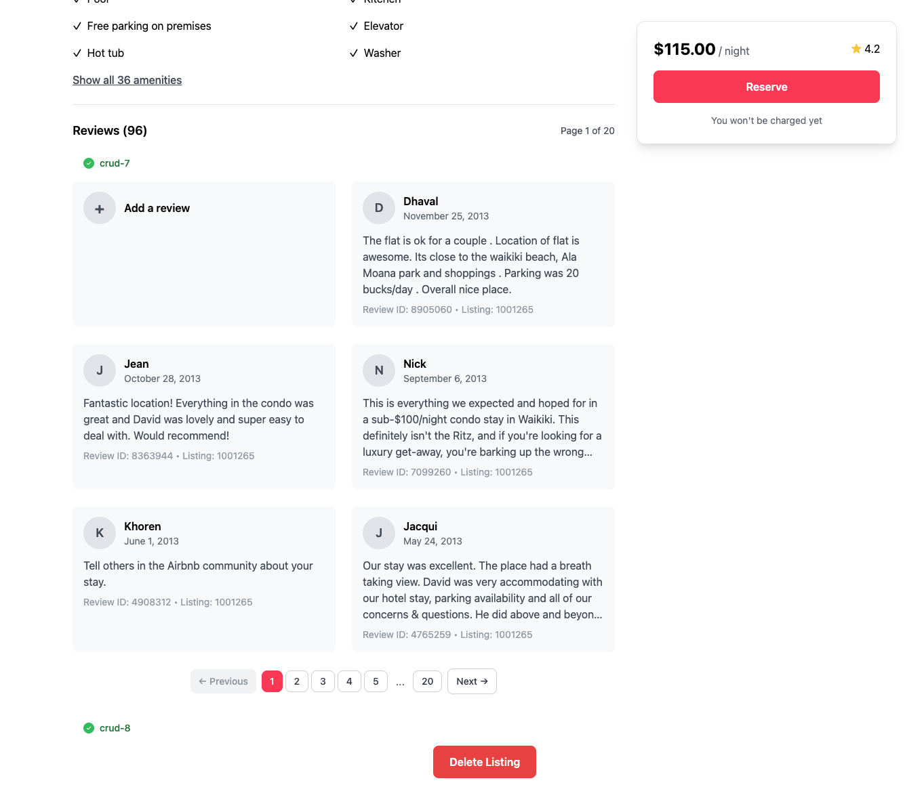

📋 Referencia del Lab

<strong>Archivo de Lab Asociado:</strong> <code>crud-8.lab.js</code>

## 🚀 Objetivo: Eliminar Documentos como un Profesional

Tu plataforma está prosperando, pero a veces es hora de decir adiós—quizás un listado ya no está disponible, o un huésped quiere que se eliminen sus datos. Como ingeniero backend, garantizas que tu plataforma se mantenga limpia, relevante y confiable manejando las eliminaciones de forma rápida y segura.

En este ejercicio, dominarás el arte de eliminar documentos por su ID.

---

### 🧩 Ejercicio: Eliminar Un Documento

1. **Abre el Archivo**  
   Navega a `server/src/lab/` y abre `crud-8.lab.js`.

2. **Localiza la Función**  
   Encuentra la función `crudDelete` en el archivo.

3. **Actualiza el Código**  
   - Implementa el código para eliminar un documento donde `_id` sea igual al parámetro `id` proporcionado.

---

### 🚦 Prueba tu API

1. Ve al directorio `server/src/lab/rest-lab`.
2. Abre `crud-8-delete-lab.http`.
3. Haz clic en **Send Request** para ejecutar la llamada a la API.
4. Verifica que la respuesta confirme la eliminación exitosa.

---

### 🖥️ Validación Frontend

Selecciona "Eliminar Listado" en la aplicación y observa cómo el registro desaparece instantáneamente—¡limpio, suave y satisfactorio!

**Verifica el Estado del Ejercicio:**  
Ve a la aplicación y comprueba si el indicador del ejercicio muestra verde, lo que indica que tu implementación es correcta.

Con este paso, no solo estás eliminando datos—estás construyendo confianza y manteniendo tu plataforma funcionando en su mejor momento.  
**¿Listo para mantener tus datos limpios? ¡Comencemos!**


