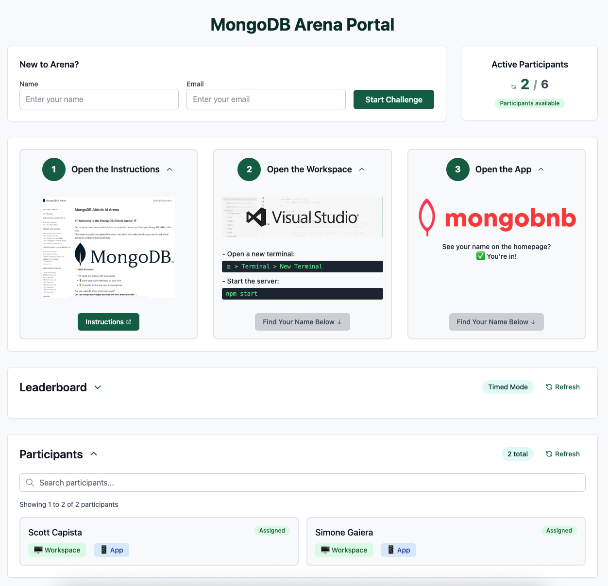
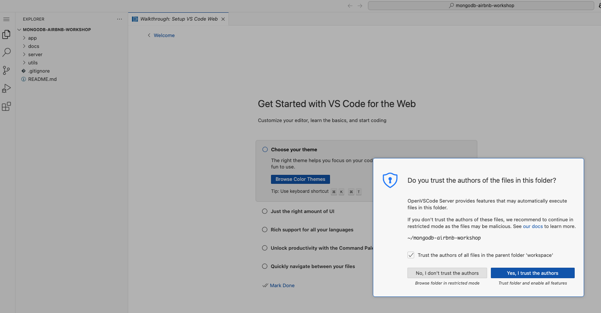
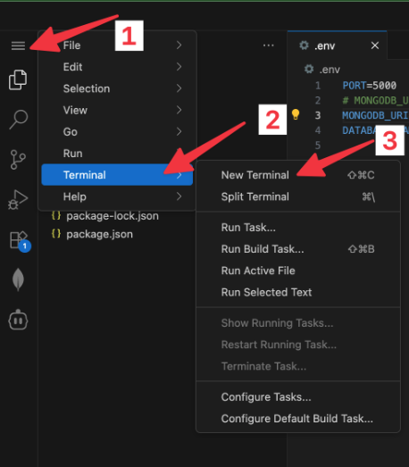
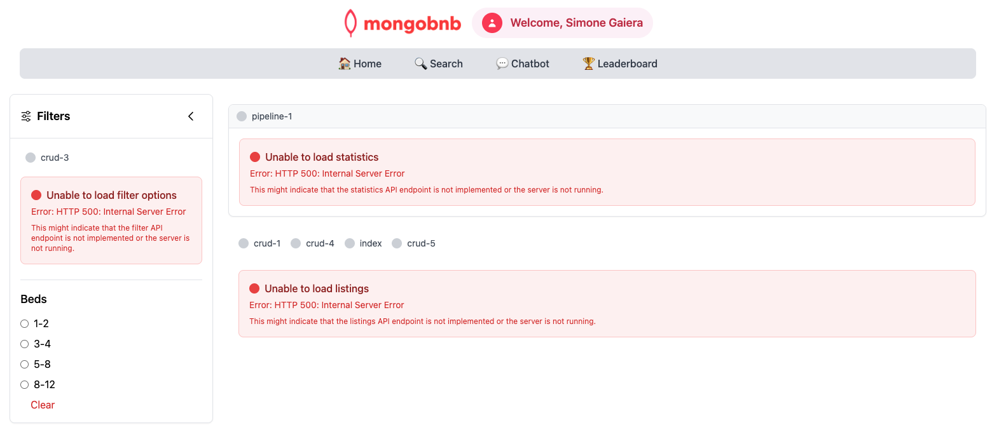
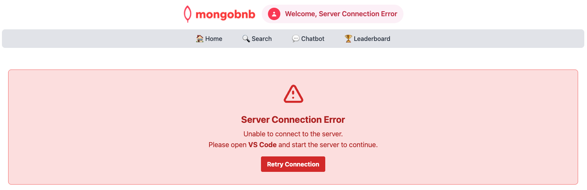
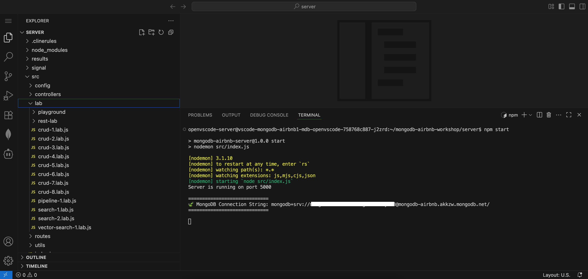
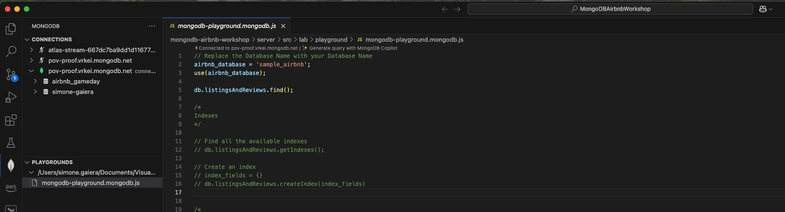
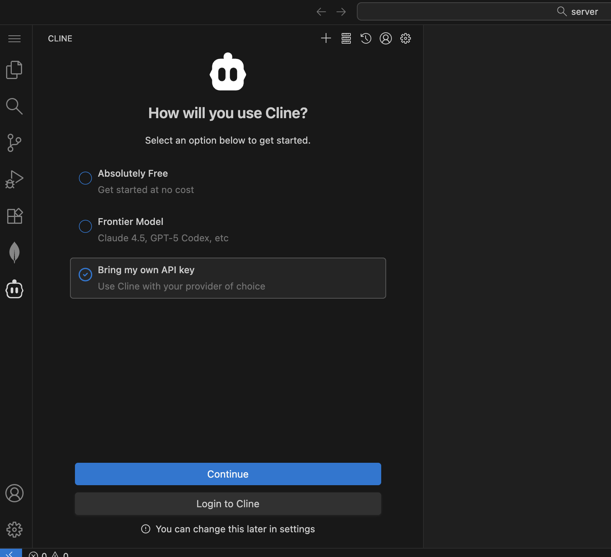
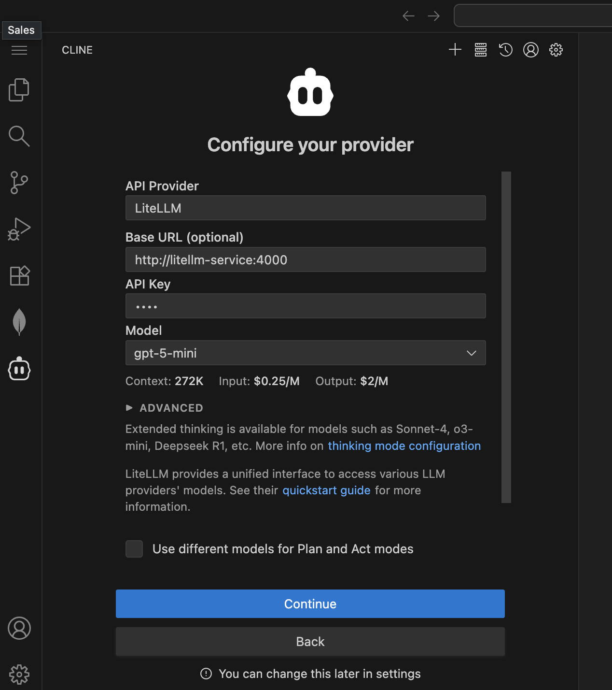
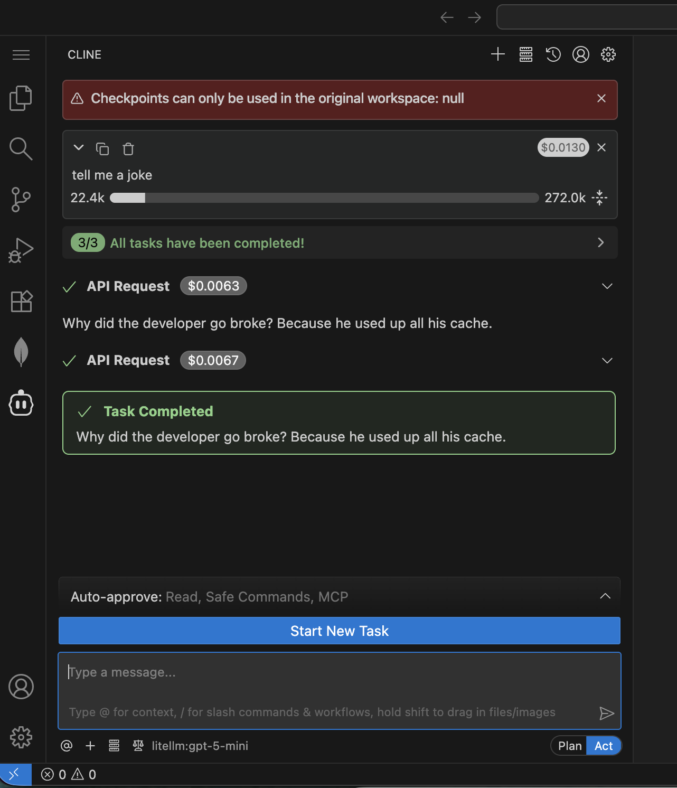

## 🌐💡 VSCode Online: Tu Playground en la Nube

¡Bienvenido a tu playground de desarrollo en la nube!  
Conéctate, codifica y explora MongoDB con estilo.

**¡Estamos aquí para _programar al ritmo_ de esta experiencia juntos—¡hagámosla inolvidable! 🚀🎶**

---

## 🚀 Paso 1: Configuración del Backend

1. **Accede a VSCode Online:**
   - Navega al Portal de Arena y verifica que tu nombre aparece en la lista de participantes. Si no está, completa el formulario "New to Arena?".
   - Abre el `Workspace`
       
2. **Confía en el Workspace:**
   - Cuando se te solicite:
     - Haz clic en **Yes, I trust the author**
     - Haz clic en **Mark Done**
   

3. **Inicia el Servidor:**
   - Abre una nueva terminal:
     ```
     ☰ > Terminal > New Terminal
     ```
     
   - Arranca el backend:
     ```bash
     npm start
     ```
   - ✅ **Verifica:** ¡Si ves un mensaje de conexión de MongoDB en los registros, estás listo!

---

## 🎨 Paso 2: Configuración del Frontend

1. **Lanza la Aplicación:**
   - Navega al Portal de Arena y abre la `App`

2. **Valida el Frontend:**    
   - ¿Ves tu nombre en la página de inicio? ✅ ¡Estás dentro!
   

   - Si ves el mensaje de error en lugar de tu nombre, verifica que tu servidor backend esté corriendo.
   
   - ¿Aún no funciona? ¡Llama a tu SA para obtener ayuda!

---

## 🔗 Paso 3: Conecta la Extensión de MongoDB

1. **Primero, Revisa si ya Tienes la Conexión:**
   - Haz clic en la **extensión de MongoDB** en la barra lateral.
   - Si ya ves una conexión llamada **MongoDB Arena - tu-usuario** en **CONNECTIONS**, ya fue configurada para ti. Solo haz clic para conectarte y salta a la Verificación de Éxito.
   - ¿No aparece ninguna conexión? Sigue los pasos de abajo para agregarla tú mismo.

2. **Obtén tu Cadena de Conexión:**  
   - Después de iniciar tu servidor backend (`npm start`), verás la cadena de conexión mostrada en la salida de la terminal.
   - **Copia** toda la cadena de conexión desde la terminal.
     ```markdown
     =============================
      🍃 MongoDB Connection String: `mongodb+srv://credentials@cluster.mongodb.net/`
     =============================
     ```
   

3. **Conéctate en VSCode:**
   - Haz clic en la **extensión de MongoDB** en la barra lateral.
   - En **CONNECTIONS**, presiona el **+** y elige **Connect with Connection String**.
   - ¡**Pega** tu URI copiado y conéctate!

4. **Verificación de Éxito:**
   - ¡Si ves tus bases de datos, estás listo para empezar!

## 🔗 Paso 4: Usa MongoDB Playground

1. **Abre el MongoDB Playground:**  
   - En VSCode Online, localiza y abre el archivo `find-playground.mongodb.js`.
   

2. **Ejecuta tu Primera Consulta:**  
   - Haz clic en el botón **Play** ▶️ en la parte superior derecha del editor.

3. **Verifica los Resultados:**  
   - ¡Si tu consulta se ejecuta exitosamente y devuelve datos de tu base de datos, estás listo!

## 🤖 Paso 5: Potencia VSCode con Cline

1. **Lanza Cline:**  
   - Haz clic en el ícono de **Cline** en la barra de herramientas de VSCode para abrir la extensión.
   - Elige **Use your own API key** cuando se te solicite.
   
2. **Configura la API:**
   - Establece **API Provider** en **LiteLLM**.
   - Ingresa las siguientes configuraciones de LiteLLM:
     - **Base URL:** `http://litellm-service:4000`
     - **API Key:** `noop`
     - **Model:** `gpt-5-mini`
   - Haz clic en **Let's go!**  
     

3. **Prueba Cline:**
   - Prueba tu configuración ingresando un prompt en Cline (por ejemplo, pídele que te cuente un chiste).
     

**Consejo:**  
¡Si no obtienes respuesta, verifica tu configuración de API o pide ayuda a tu SA!


