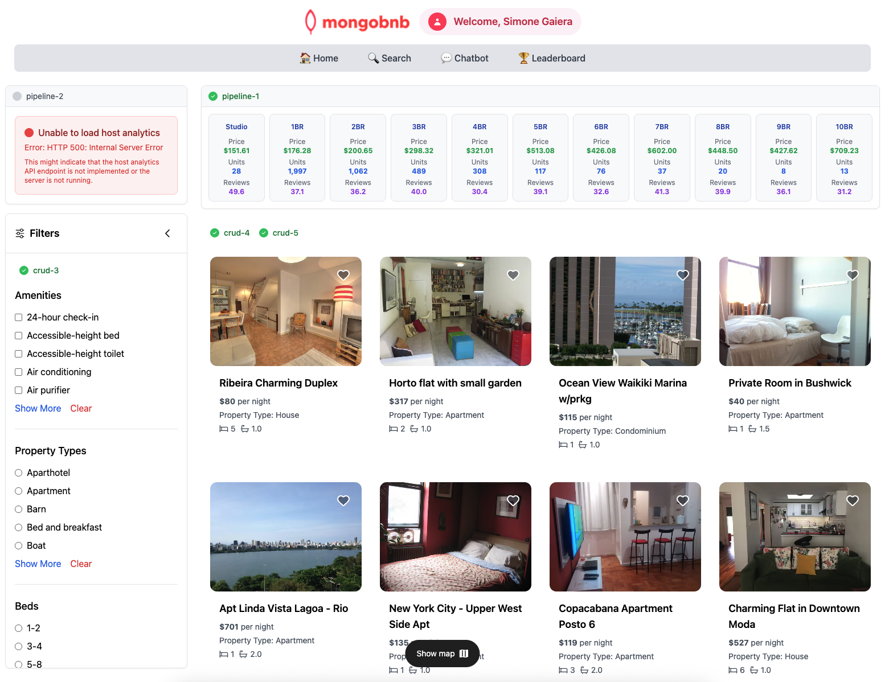

📋 Referencia del Lab

<strong>Archivo de Lab Asociado:</strong> <code>pipeline-1.lab.js</code>

## 🚀 Objetivo: Análisis Inteligente de Inversión Inmobiliaria

Tu plataforma ha llamado la atención de inversores inmobiliarios que necesitan perspectivas basadas en datos para tomar decisiones de inversión informadas. Quieren comprender los segmentos del mercado, los patrones de precios y el rendimiento de propiedades según el número de camas. Como ingeniero backend, tu tarea es crear un análisis de mercado que revele oportunidades de inversión.

En este ejercicio fundamental de agregación, aprenderás conceptos esenciales del pipeline de MongoDB analizando segmentos del mercado inmobiliario.

---

### 🎯 Desiderata del Ejercicio: Qué Necesitas Construir

Tu misión es crear un pipeline de agregación que proporcione un análisis limpio del mercado de inversión:

**🔍 Control de Calidad de Datos:**
- Filtra propiedades de inversión legítimas: `price > 0` y `number_of_reviews > 0`
- Enfócate en propiedades residenciales con `beds` entre 0-10 y `accommodates > 0`
- Excluye datos de prueba y valores extremos que distorsionarían el análisis

**📊 Segmentación del Mercado:**
- Agrupa propiedades por número de camas para crear segmentos de mercado significativos
- Calcula métricas clave de inversión: precio promedio, tamaño del mercado y actividad de huéspedes
- Genera perspectivas para cada segmento desde estudios (0 camas) hasta casas grandes (10 camas)

**🎨 Salida Lista para el Negocio:**
- Transforma datos técnicos en formato amigable para inversores
- Redondea valores numéricos apropiadamente para presentación financiera
- Elimina campos técnicos de MongoDB para informes empresariales limpios

### 🧩 Ejercicio: Implementación Paso a Paso

1. **Abre el Archivo**  
   Navega a `server/src/lab/` y abre `pipeline-1.lab.js`.

2. **Encuentra la Función**  
   Localiza la función `aggregationPipeline` con instrucciones detalladas.

3. **Construye el Pipeline de 4 Etapas**  
   - **Etapa 1 - $match**: Filtra propiedades de inversión de calidad (`price > 0`, `number_of_reviews > 0`, `beds` entre 0-10, `accommodates > 0`)
   - **Etapa 2 - $group**: Agrupa por campo `beds` y calcula `averagePrice`, `propertyCount` y `averageReviews`
   - **Etapa 3 - $project**: Transforma la salida con `_id: 0`, `beds`, `averagePrice` (redondeado a 2 decimales), `propertyCount`, `averageReviews` (redondeado a 1 decimal)
   - **Etapa 4 - $sort**: Ordena por campo `beds` ascendente (1) para progresión lógica de estudios a casas grandes

---

### 🚦 Prueba tu API

1. Ve a `server/src/lab/rest-lab`.
2. Abre `pipeline-1-statistics-lab.http`.
3. Haz clic en **Send Request** para llamar a la API.
4. ¡Verifica que obtienes segmentos de mercado con precios y conteos de propiedades para camas 0-10!

---

### 🖥️ Validación Frontend

- Verifica la sección "Show Statistics" para ver tu análisis de mercado en acción.
- Cada segmento debe mostrarse como una fila con perspectivas de inversión.

**Verifica el Estado del Ejercicio:**  
Ve a la aplicación y verifica que el indicador del ejercicio muestra verde, confirmando tu dominio de la agregación.

¡Este ejercicio introduce conceptos fundamentales de agregación que necesitarás para análisis avanzados!

**¿Listo para desbloquear perspectivas del mercado a través de la agregación de datos? ¡Comencemos!**


