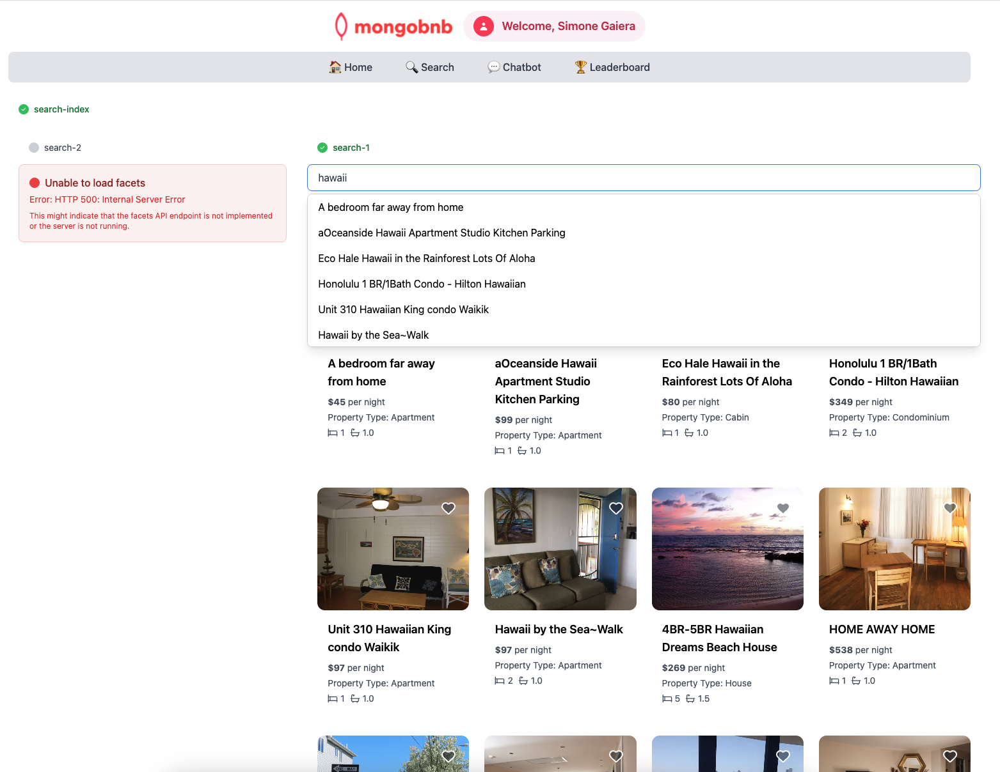

📋 Referencia del Lab

<strong>Archivo de Lab Asociado:</strong> <code>search-1.lab.js</code>

## 🚀 Objetivo: Autocompletado que Impresiona

Tu negocio quiere hacer que buscar la estancia perfecta sea fácil y delicioso. Imagina a un huésped escribiendo solo unas pocas letras e instantáneamente viendo sugerencias inteligentes y tolerantes a errores tipográficos. Como ingeniero backend, estás a punto de dar vida a esta magia con MongoDB Atlas Search.

¡Aprovecha la magia de MongoDB Atlas Search para construir una función de autocompletado rápida y elegante que tus usuarios amarán!

---

### 🧩 Ejercicio: Autocompletado como un Profesional

1. **Abre el Archivo**  
   Ve a `server/src/lab/` y abre `search-1.lab.js`.

2. **Encuentra la Función**  
   Localiza la función `autocompleteSearch`.

3. **Define el Pipeline**  
   - Agrega una etapa `$search` en el índice `search_index`.  
   - Usa `autocomplete` en el campo `name`.  
   - Habilita la búsqueda `fuzzy` para resultados tolerantes a errores tipográficos.  
   - Limita los resultados a 10 documentos.  
   - Usa `$project` para devolver solo el campo `name`.

---

### 🚦 Prueba tu API

1. Ve a `server/src/lab/rest-lab`.  
2. Abre `search-1-autocomplete-lab.http`.  
3. Haz clic en **Send Request** para llamar a la API.  
4. Confirma que la respuesta contiene los resultados esperados.

---

### 🖥️ Validación Frontend

Escribe `"hawaii"` en la barra de búsqueda y observa cómo aparecen las sugerencias de autocompletado como magia—¡rápidas, relevantes y amigables!

**Verifica el Estado del Ejercicio:**  
Ve a la aplicación y comprueba si el indicador del ejercicio muestra verde, lo que indica que tu implementación es correcta.

Con este paso, no solo estás construyendo una función—estás haciendo a tus usuarios felices y tu plataforma inolvidable.  
**¿Listo para sorprender a tus huéspedes con búsqueda instantánea? ¡Comencemos!**


