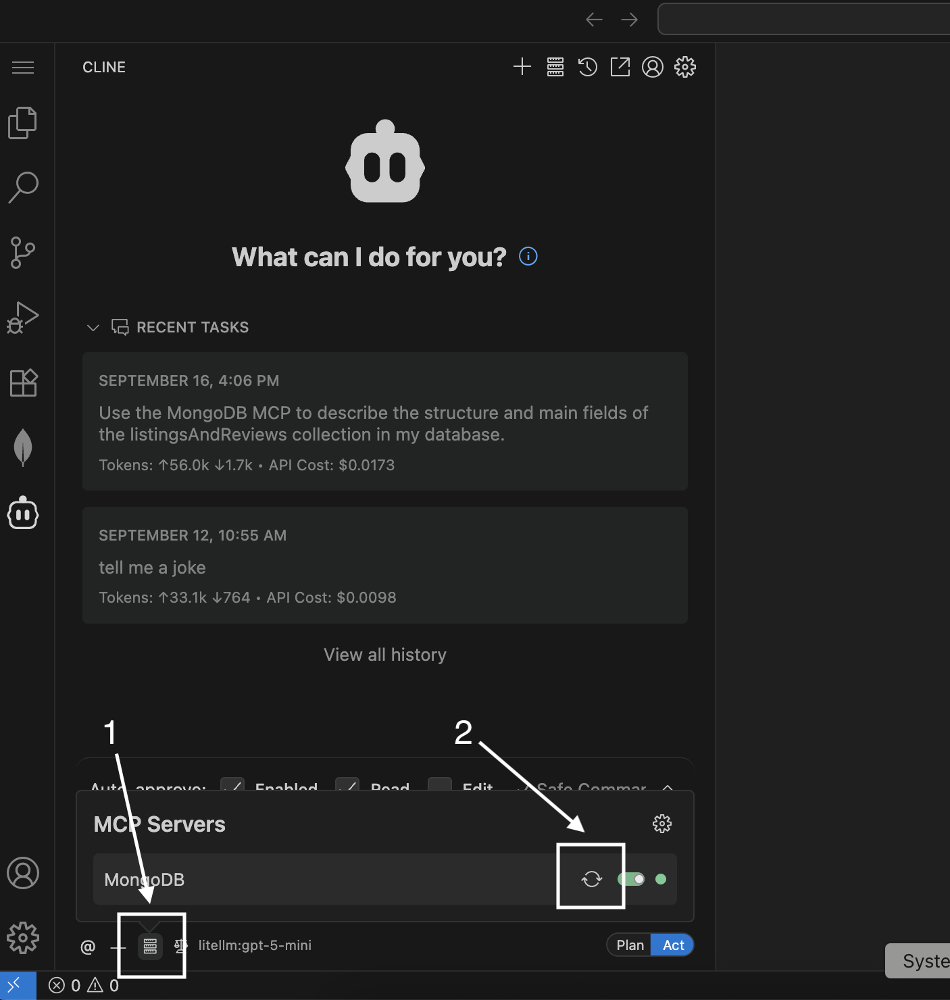
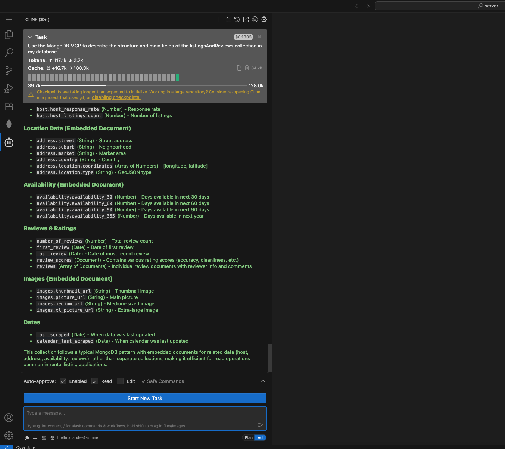

## 🧪 Entendendo sua Coleção MongoDB

Antes de começar a consultar ou criar recursos, é importante saber **o que há dentro do seu banco de dados**.

Para este workshop, você trabalhará com a coleção `listingsAndReviews`. Vamos explorar sua estrutura para que você saiba quais dados você tem e como usá-los!

---

### 🤖 Use Cline + MongoDB MCP

Usaremos o **Cline** e o **MongoDB MCP** para descrever rapidamente a estrutura de sua coleção.

#### 1. Abra o Cline no VSCode

- Clique no ícone **Cline** na barra lateral do VSCode para abrir o painel de chat.

#### 2. Cole Este Prompt

**📋 Prompt:** Copie e cole isso no Cline:

> Use o MongoDB Arena MCP Server para descrever a estrutura e os principais campos da coleção listingsAndReviews no meu banco de dados. Liste todos os bancos de dados e coleções disponíveis para mim primeiro.

**⚠️ Nota:** Se encontrar algum problema, tente atualizar o MCP.

#### 3. Revise a Resposta

- O Cline analisará sua coleção e retornará um resumo dos principais campos, seus tipos e valores de exemplo.
- Procure por:
  - **Campos de nível superior** (p. ex., `name`, `address`, `reviews`)
  - **Campos aninhados** (p. ex., `address.street`, `reviews.rating`)
  - **Tipos de dados** (string, number, array, object, etc.)

---

### 📚 Aprenda Mais

- [Documentação MongoDB MCP](https://www.mongodb.com/docs/mcp-server/overview/?client=claude&deployment-type=atlas)

---

**Dica:**  
Explorar a estrutura da sua coleção agora vai poupar tempo e ajudá-lo a escrever consultas melhores depois. Conhecer bem seus dados é a chave para desbloquear seu valor!


