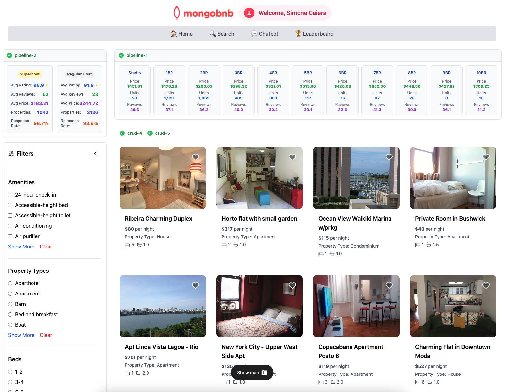

📋 Referência do Lab

<strong>Arquivo de Lab Associado:</strong> <code>pipeline-2.lab.js</code>

## 🚀 Objetivo: Análise de Desempenho Superanfitrião vs Anfitrião Regular

O sucesso de sua plataforma depende de entender o que torna os anfitriões excepcionais. A equipe de marketing quer mostrar a "vantagem do Superanfitrião" para atrair anfitriões de qualidade, enquanto a equipe de produto precisa de insights para melhorar a integração de anfitriões. Como engenheiro backend, você é o detetive de dados que pode desbloquear os segredos escondidos em documentos de anfitriões aninhados.

Neste exercício, você aproveitará o poder do MongoDB para trabalhar com documentos aninhados.

---

### 🎯 Desiderata do Exercício: O Que Você Precisa Construir

Sua missão é criar um pipeline de agregação que mostre análise de dados avançada:

**🔍 Controle de Qualidade de Dados:**
- Filtre anúncios legítimos: `price > 0` e `number_of_reviews > 0`
- Foque em propriedades com atividade de mercado real e feedback de hóspedes

**🏗️ Transformação Inteligente de Dados:**
- Trate dados ausentes de `host.host_is_superhost` com elegância
- Crie campos calculados dinamicamente dentro do pipeline

**📊 Inteligência de Negócios:**
- Compare Superanfitriões vs Anfitriões Regulares em múltiplas dimensões:
  - Avaliações médias, contagens de avaliações e estratégias de preços
  - Tamanhos de portfólio de anfitriões e taxas de resposta

**🎨 Formatação de Saída Limpa:**
- Transforme nomes de campos técnicos em rótulos amigáveis para o negócio
- Arredonde valores numéricos adequadamente para apresentação

### 🧩 Exercício: Implementação Passo a Passo

1. **Abra o Arquivo**  
   Navegue para `server/src/lab/` e abra `pipeline-2.lab.js`.

2. **Encontre a Função**  
   Localize a função `hostPerformanceAnalytics` com instruções detalhadas.

3. **Construa o Pipeline de 5 Estágios**  
   - **Estágio 1 - $match**: Filtre dados de qualidade
   - **Estágio 2 - $addFields**: Crie campo `isSuperhost` usando `$ifNull`
   - **Estágio 3 - $group**: Agrupe por status de superanfitrião e calcule 6 métricas-chave
   - **Estágio 4 - $project**: Transforme a saída com rótulos legíveis e arredondamento adequado
   - **Estágio 5 - $sort**: Ordene por avaliação média (descendente)

---

### 🚦 Teste sua API

1. Vá para `server/src/lab/rest-lab`.
2. Abra `pipeline-2-host-analytics-lab.http`.
3. Clique em **Send Request** para chamar a API.
4. Admire os insights comparando Superanfitriões vs anfitriões regulares!

---

### 🖥️ Validação Frontend

- Verifique a seção "Host Analytics" para ver sua análise de documentos aninhados em ação.

**Verifique o Status do Exercício:**  
Vá para o aplicativo e verifique que o indicador do exercício mostra verde.

Este exercício demonstra a capacidade natural do MongoDB de trabalhar com estruturas de dados complexas e aninhadas!  
**Pronto para desbloquear o poder dos documentos aninhados? Vamos começar!**


