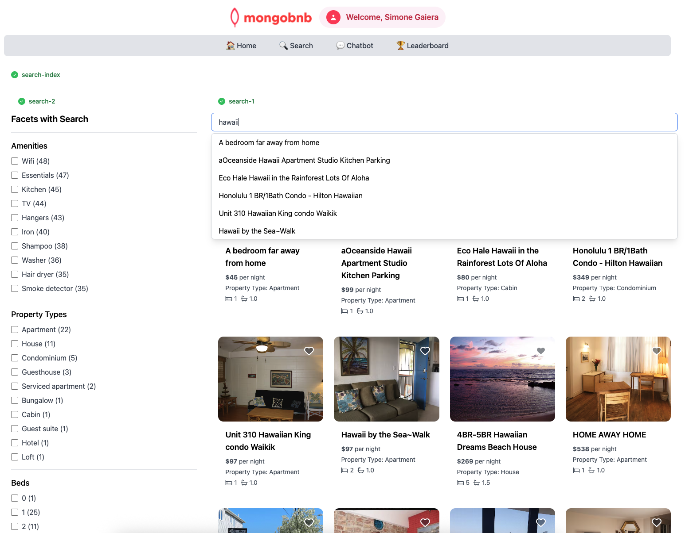

📋 Referência do Lab

<strong>Arquivo de Lab Associado:</strong> <code>search-2.lab.js</code>

## 🚀 Objetivo: Pesquisa Facetada que Brilha

A pesquisa de sua plataforma já é rápida e inteligente, mas agora seu negócio quer capacitar os usuários a explorar e filtrar resultados com facilidade. Imagine um hóspede pesquisando "hawaii" e instantaneamente reduzindo os resultados por comodidades, tipo de propriedade ou número de camas—tudo com um único clique. Como engenheiro backend, você está prestes a tornar essa experiência de descoberta de próximo nível uma realidade com as facetas do MongoDB Atlas Search.

A pesquisa facetada permite que seus usuários dividam e analisem os resultados, tornando fácil encontrar exatamente o que querem.

---

### 🧩 Exercício: Facetas em Ação

1. **Abra o Arquivo**  
   Navegue para `server/src/lab/` e abra `search-2.lab.js`.

2. **Localize a Função**  
   Encontre a função `facetSearch` no arquivo.

3. **Defina o Pipeline**  
   - Use `$searchMeta` no índice `search_index`.  
   - Aplique `facet` em seu pipeline.  
   - Para o `operator`, reutilize a pesquisa `autocomplete` do exercício anterior.  
   - Crie estas facetas:  
     - `amenities`: uma faceta de string  
     - `property_type`: uma faceta de string  
     - `beds`: uma faceta numérica com limites de 0 a 9, e "Other" para valores adicionais  

---

### 🚦 Teste sua API

1. Vá para `server/src/lab/rest-lab`.  
2. Abra `search-2-facet-lab.http`.  
3. Clique em **Send Request** para chamar a API.  
4. Certifique-se de ver resultados válidos na resposta.

---

### 🖥️ Validação Frontend

Digite `"hawaii"` na barra de pesquisa e veja as novas facetas aparecerem—filtre e explore seus resultados instantaneamente!

**Verifique o Status do Exercício:**  
Vá para o aplicativo e veja se o indicador do exercício mostra verde, indicando que sua implementação está correta.

Com este passo, você não está apenas adicionando filtros—está dando a seus usuários o poder de descobrir sua estadia perfeita, do jeito deles.  
**Pronto para tornar a pesquisa verdadeiramente interativa? Vamos começar!**


