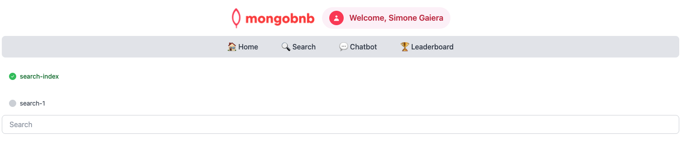

## 🚀 Objetivo: Potencialize a Pesquisa com Índices de Atlas Search

Seu negócio quer encantar os usuários com resultados de pesquisa instantâneos e relevantes e sugestões inteligentes. Mas antes de poder oferecer essa experiência mágica, você precisa lançar as bases: um poderoso índice do Atlas Search. Como engenheiro backend, você está preparando o cenário para autocomplete, navegação facetada e descoberta ultrarrápida.

Neste exercício, você vai projetar e construir um índice do Atlas Search personalizado—desbloqueando todo o potencial dos seus dados.

---

### 🧩 Exercício: Construa seu Índice de Pesquisa

Crie seu índice com estas especificações:

1. **Configuração Básica**
   - **Nome:** `search_index`
   - **Analisador:** `lucene.english`
   - **Mapeamento Dinâmico:** Desativado

2. **Mapeamentos de Campos**
   - **name** (para autocomplete)
     - Tipo: `autocomplete`
     - Analisador: `lucene.english`
     - Tokenização: `edgeGram`
     - Grama mín: `3`
     - Grama máx: `7`
     - Dobramento de diacríticos: `false`
   
   - **amenities** (para filtragem)
     - `token` (valor: `none`)

   - **property_type** (para filtragem)
     - `token` (valor: `none`)

   - **beds** (para filtragem numérica)
     - `number`

---

### 🛠️ Como Completar este Exercício

Escolha sua ferramenta favorita e indexe:
- Interface web do **MongoDB Atlas**
- **MongoDB Compass**
- **Extensão do MongoDB** com o MongoDB Playground fornecido

#### 💻 **Usando VS Code?**
- Sugerimos usar o recurso Playground para uma experiência rápida e interativa.
- No VSCode Online, localize e abra o arquivo `search-index-playground.mongodb.js`.
  

---

### 🖥️ Validação Frontend

**Verifique o Status do Exercício:**  
Vá para o aplicativo e veja se o indicador do exercício mostra verde.

---

### 🚦 O Que Esperar

Depois que seu índice estiver ativo, sua plataforma estará pronta para pesquisa de texto completo ultrarrápida e filtros dinâmicos.

Com este passo, você não está apenas configurando campos—está construindo a espinha dorsal de uma experiência de pesquisa de classe mundial.  
**Pronto para tornar seus dados descobríveis? Vamos começar!**


