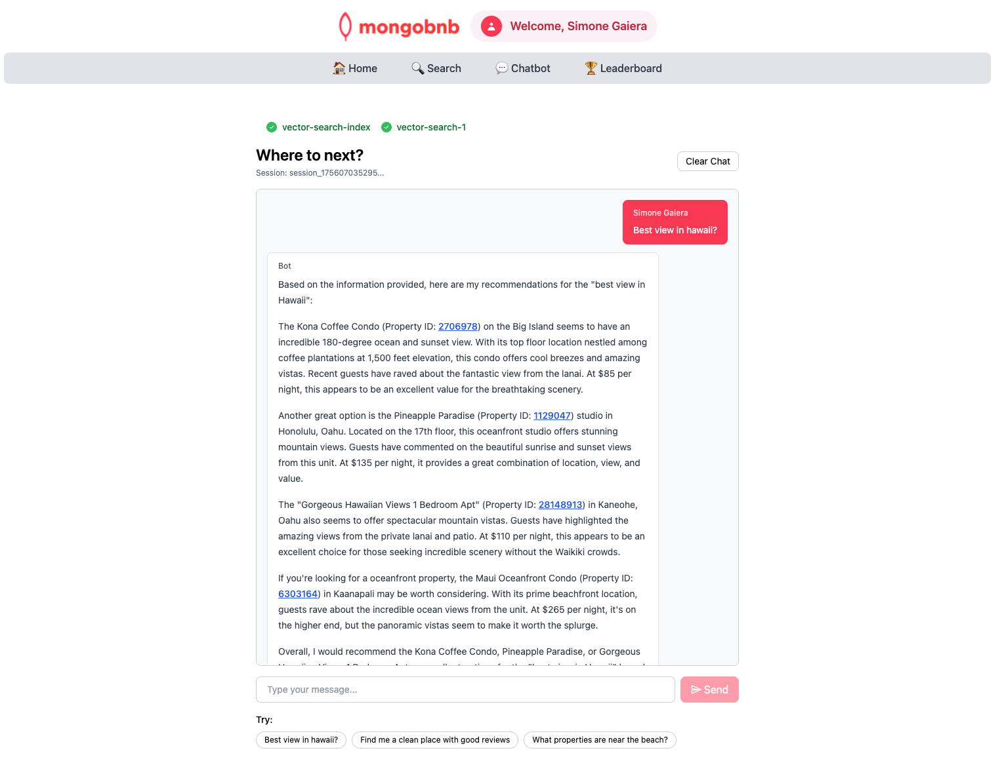

📋 Referência do Lab

<strong>Arquivo de Lab Associado:</strong> <code>vector-search-1.lab.js</code>

## 🚀 Objetivo: Pesquisa Semântica que Impressiona

Seu negócio quer tornar a busca pela estadia perfeita fácil e inteligente. Imagine um hóspede digitando uma consulta em linguagem natural e instantaneamente vendo sugestões inteligentes e cientes da intenção—ajudando-o a encontrar o destino dos sonhos mesmo sem usar as palavras exatas. Como engenheiro backend, você está prestes a dar vida a essa pesquisa de próximo nível com o MongoDB Atlas Vector Search.

Aproveite o poder do MongoDB Atlas Vector Search para construir um recurso de pesquisa semântica que seus usuários vão adorar!

---

### 🧩 Exercício: Pesquisa Semântica como um Profissional

1. **Abra o Arquivo**  
   Vá para `server/src/lab/` e abra `vector-search-1.lab.js`.

2. **Encontre a Função**  
   Localize a função `vectorSearch`.

3. **Defina o Pipeline**  
   - Adicione um estágio `$vectorSearch` usando seu índice `vector_index`.  
   - Use o campo `description` como caminho de pesquisa vetorial.
   - Passe a string de consulta do usuário como `query: { text: query }` (exigido pelo índice `autoEmbed`).
   - Adicione um filtro em `property_type` para resultados mais relevantes.  
   - Defina `numCandidates` como 100 e `limit` como 10 no estágio `$vectorSearch`.  

---

### 🚦 Teste sua API

1. Vá para `server/src/lab/rest-lab`.  
2. Abra `vector-search-1-lab.http`.  
3. Clique em **Send Request** para chamar a API.
4. Confirme que a resposta contém os resultados semanticamente relevantes esperados.

---

### 🖥️ Validação Frontend

Digite uma consulta em linguagem natural (p. ex., `"melhor vista no hawaii"`) na barra de pesquisa e veja sugestões inteligentes e relevantes aparecerem—com o poder da IA e pesquisa vetorial!

**Verifique o Status do Exercício:**  
Vá para o aplicativo e veja se o indicador do exercício mostra verde, indicando que sua implementação está correta.

Com este passo, você não está apenas construindo um recurso—está habilitando uma nova era de descoberta e encantamento para seus usuários.  
**Pronto para impressionar seus hóspedes com pesquisa semântica? Vamos começar!**


