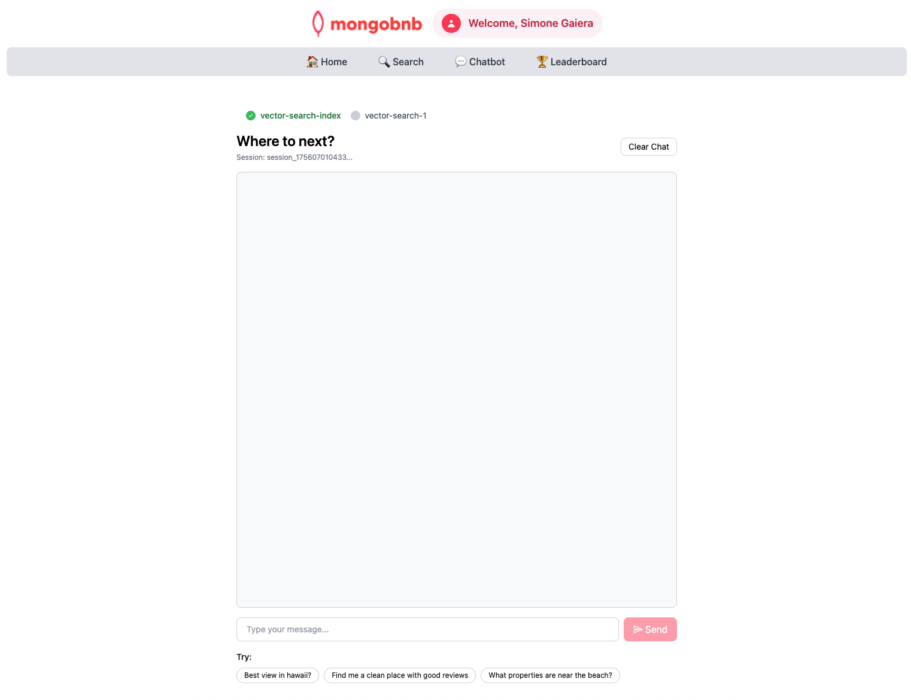

## 🚀 Objetivo: Habilitar Pesquisa Semântica com Índices de Atlas Vector Search

Seus usuários querem uma pesquisa mais inteligente, com IA—encontrando a estadia perfeita mesmo com consultas em linguagem natural. Para isso, você criará um **índice de Vector Search** no MongoDB Atlas. Como engenheiro backend, você está construindo a base para pesquisa semântica, IA conversacional e descoberta de próximo nível.

Neste exercício, você configurará um índice vetorial que habilita pesquisa semântica nas descrições de seus anúncios, usando o modelo de embedding embutido do MongoDB, e adicionará um campo de filtro para tipo de propriedade.

---

### 🧩 Exercício: Construa seu Índice de Vector Search

Configure seu índice com estas especificações:

- **Nome do Índice:** `vector_index`
- **Caminho do Campo de Texto:** `description`
- **Modelo de Embedding:** `voyage-3-large`
- **Caminho do Campo de Filtro:** `property_type`

---

### 🛠️ Como Completar este Exercício

Escolha sua ferramenta favorita e indexe:
- Interface web do **MongoDB Atlas**
- **MongoDB Compass**
- **Extensão do MongoDB** com o MongoDB Playground fornecido

#### 💻 **Usando VS Code?**
- Sugerimos usar o recurso Playground para uma experiência rápida e interativa.
- No VSCode Online, localize e abra o arquivo `vector-search-index-playground.mongodb.js` (geralmente encontrado no canto inferior esquerdo do Explorer).
  

---

### 🖥️ Validação Frontend

**Verifique o Status do Exercício:**  
Vá para o aplicativo e veja se o indicador do exercício mostra verde, indicando que sua implementação está correta.

---

### 🚦 O Que Esperar

Com seu índice vetorial ativo, sua plataforma estará pronta para:
- **Pesquisa semântica** que entende a intenção do usuário, não apenas palavras-chave
- **Chatbots com IA** que correspondem consultas de hóspedes aos melhores anúncios
- **Resultados mais rápidos e relevantes** com filtragem por tipo de propriedade
- A base para experiências de descoberta avançadas e conversacionais

Você não está apenas indexando dados—está habilitando a próxima geração de pesquisa e IA para sua plataforma.  
**Pronto para desbloquear a pesquisa semântica? Vamos começar!**


