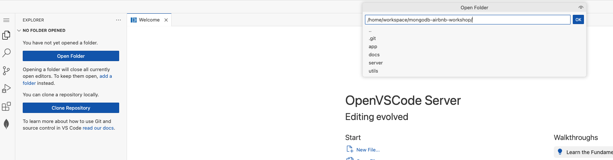

## 🌐💡 VSCode Online: Your Cloud Playground

Welcome to your cloud-powered dev playground!  
Let's get you connected, coding, and exploring MongoDB in style.

**We're here to _vibe code_ this experience together—let's make it unforgettable! 🚀🎶**

---






## 🔗 Step {{ step }}: Supercharge VSCode with Cline

1. **Launch Cline:**  
   - Click the **Cline** icon in the VSCode toolbar to open the extension.
   - Choose **Use your own API key** when prompted.
   
2. **Configure the API:**
   - Set **API Provider** to **LiteLLM**.
   - Enter the following LiteLLM settings:
     - **Base URL:** `http://litellm-service:4000`
     - **API Key:** `noop`
     - **Model:** `gpt-5-mini`
   - Click **Let's go!**  
     

3. **Save and Test:**
   - Click **Save** to apply your settings.
   - Test your setup by entering a prompt in Cline (for example, ask it to tell you a joke).
     

---





## 🎨 Step {{ step }}: Frontend Setup

1. **Launch the App:**
   - Navigate to the Arena Portal and open the `App`

---



## 🚀 Step {{ step }}: Backend Setup

1. **Access VSCode Online:**
> **Note:** You can use the default customer page to access your workspace

   - Go to:
     ```
     https://<username>.<customer>.mongoarena.com/
     ```
   - In the `Explorer`, click **Open Folder** and navigate to:
     ```
     /home/workspace/mongodb-ai-arena/backend/
     ```
     Click **Ok**.
       
2. **Trust the Workspace:**
   - When prompted:
     - Click **Yes, I trust the author**
     - Click **Mark Done**
  

---




## 🔗 Step {{ step }}: Connect the MongoDB Extension

> **Already there?** If **CONNECTIONS** in the MongoDB extension already lists **MongoDB Arena - your-username**, it was set up for you — just click it to connect and skip this step.

1. **Grab Your Connection String:**  
   - Open `/backend/.env` and copy your MongoDB URI:
     ```markdown
     MONGODB_URI=`mongodb+srv://<username>:<password>@<cluster>.mongodb.net`/?retryWrites=true&w=majority
     ```

2. **Connect in VSCode:**
   - Click the **MongoDB extension** in the sidebar.
   - In **CONNECTIONS**, hit the **+** and choose **Connect with Connection String**.
   - Paste your URI and connect!

3. **Success Check:**
   - If you see your databases, you're ready to roll!



---

## 🛠️ Troubleshooting

- **Server not starting?**  
  Double-check your terminal commands and directory.

- **Still stuck?**  
  Ping your SA for help—no shame in asking!

---

✨ That's it! You're set to code, create, and explore.  
Happy hacking!
